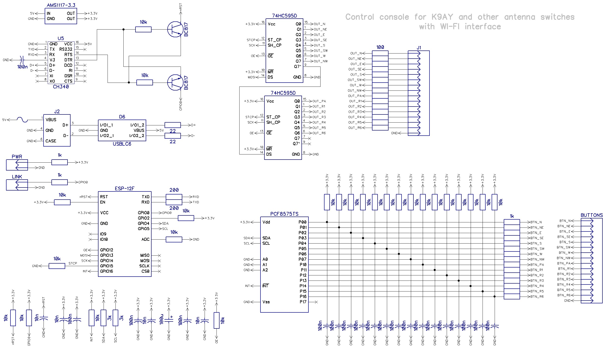
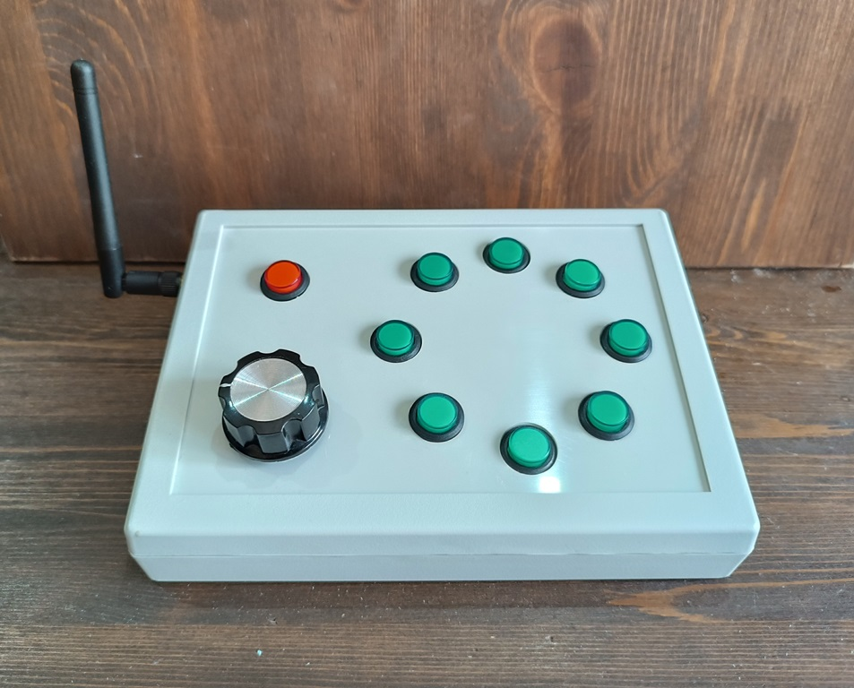
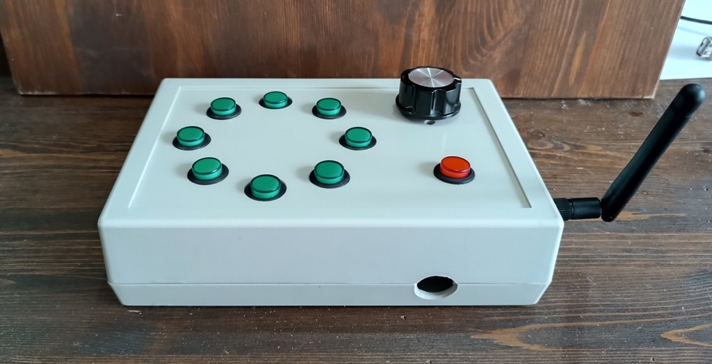

## WI-FI console for K9AY RX antenna switch

This console works with [K9AY wifi box](https://github.com/ra0sms/K9AY_with_wifi).

* Enclosure - [Gainta G1183](https://www.gainta.com/en/g1183g.html)
* Power supply - 5V 100 mA via USB Type B

Gerber files and schematic - DipTrace.

Source Code - Arduino IDE.

More information - https://ra0sms.com/wifi-client-console/
Video - https://www.youtube.com/watch?v=_KDDLC8t_J8

-------------------------------------------------------------------------------

### Schematic:

### Front panel:

### Rear panel:

